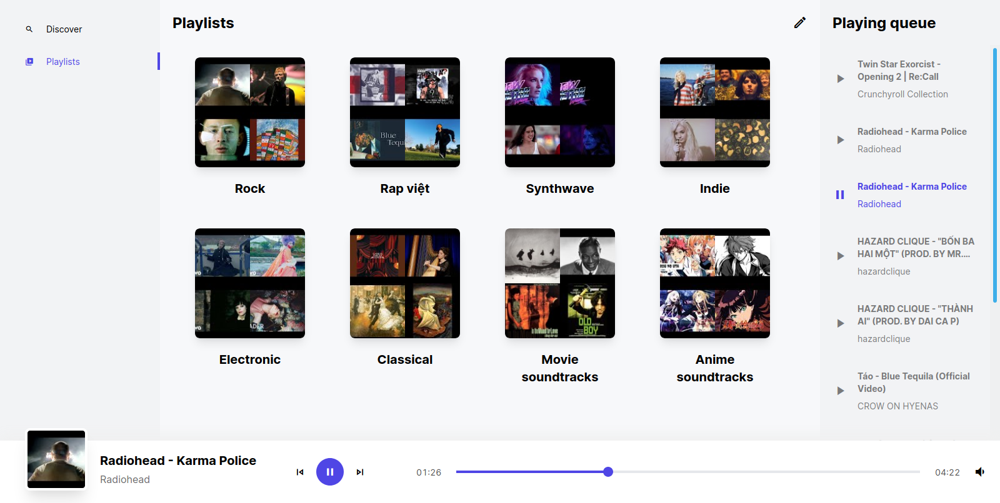
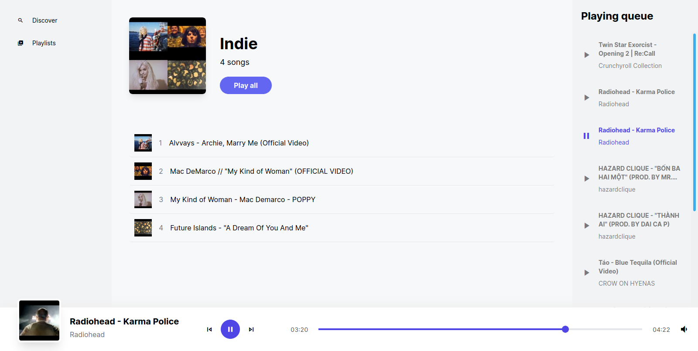

# SoundFlow
> A music player inspired by [xaudio](https://github.com/xaudio-me/xaudio)

## Feature

- Supported sources:
  - Youtube
- Playlist
- Playing queue
- Simple UI

## Screenshots




## How to use?

You must host it yourself, either locally or on PaaS services such as Heroku.

```
# First build the front-end

cd www
npm install
npm run dist

# Then run the flask back-end
flask run
```

Please refer to the [Dockerfile](./Dockerfile) for more info.

## Author

- [Viet-Hung Nguyen](https://github.com/ZeroX-DG)
